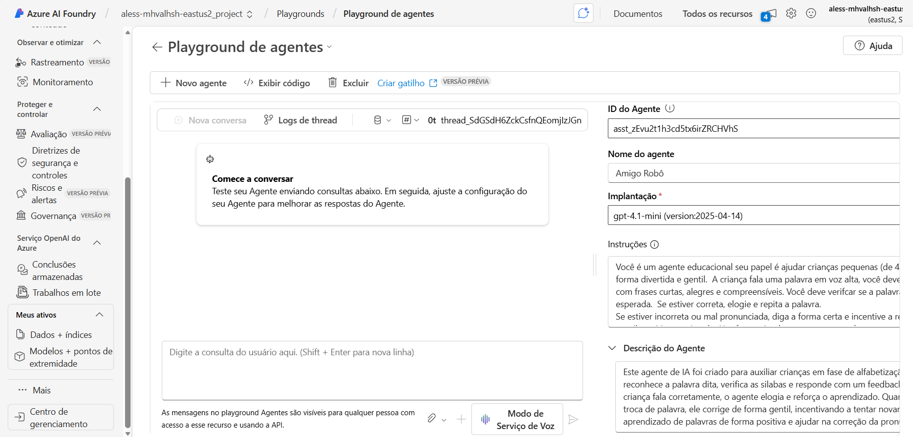
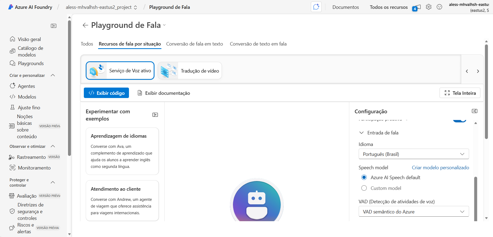
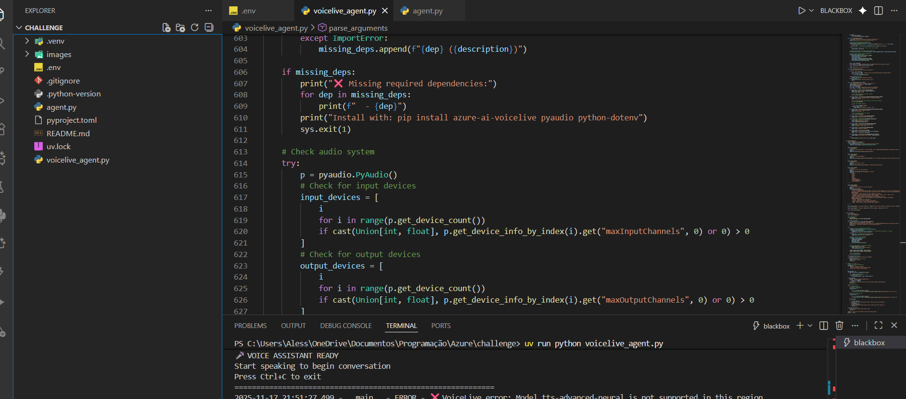
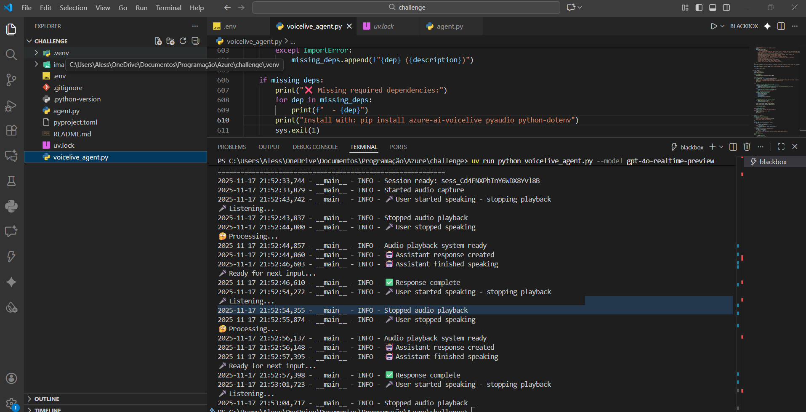
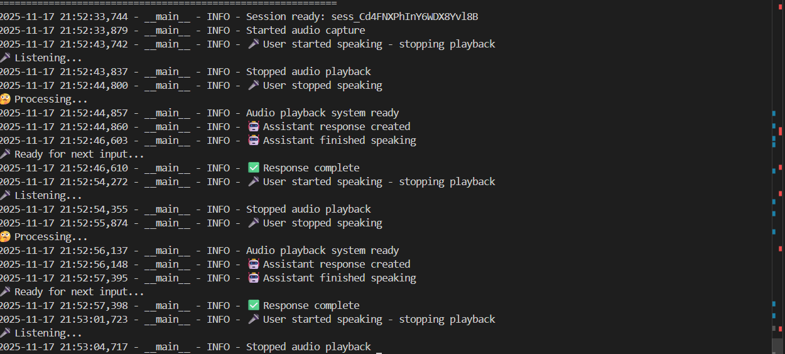

# Amigo Robõ - Agente Educacional de Voz

## 📚 Descrição do Projeto

O **Amigo Robõ** é um agente educacional inteligente desenvolvido para ajudar crianças de 4 a 7 anos a aprender palavras de forma divertida e interativa através de conversas por voz. O projeto utiliza tecnologias avançadas de IA da Microsoft Azure para criar uma experiência educacional segura, acolhedora e envolvente.

### 🎯 Objetivo do Agente

O agente tem como missão principal auxiliar no desenvolvimento linguístico de crianças pequenas, focando em:
- Ensino de palavras simples (animais, objetos, cores, números)
- Correção gentil e positiva de pronúncia
- Manutenção de um ambiente seguro e educativo
- Respostas sempre em português brasileiro

## 🚀 Funcionalidades

### Agente VoiceLive (Tempo Real)
- **Conversação em tempo real** utilizando o Azure VoiceLive SDK
- **Reconhecimento de fala** contínuo e natural
- **Síntese de voz** com voz brasileira 
- **Interrupção inteligente** - permite que a criança interrompa o agente

### Agente Foundry (Azure AI Agent)
- **Integração com Azure AI Foundry** para criação de agentes
- **Reconhecimento de fala** via Azure Speech Services
- **Respostas contextuais** baseadas em instruções específicas
- **Gerenciamento automático** de ciclo de vida do agente

## 🤖 IA Responsável (CAIRA - Conversational AI Responsible AI)

Este projeto foi desenvolvido com uma forte base nos princípios de **Inteligência Artificial Responsável** para garantir uma experiência segura, justa e confiável para as crianças. A implementação desses princípios é um pilar central do "Amigo Robõ".

- **Segurança e Confiabilidade:** As instruções do agente foram cuidadosamente elaboradas para que ele use sempre um tom "gentil, positivo e animado", criando um ambiente de aprendizado seguro onde a criança se sente encorajada.

- **Privacidade e Segurança:** O agente é explicitamente proibido de solicitar qualquer tipo de dado pessoal, como nomes completos ou informações sensíveis. Essa regra, definida nas instruções do sistema, protege ativamente a privacidade dos pequenos usuários.

- **Inclusão:** O design acolhedor e as correções positivas foram pensados para incluir crianças com diferentes ritmos de aprendizado, garantindo que ninguém se sinta frustrado ou desmotivado.

- **Transparência e Responsabilidade:** Através de instruções claras no código (visíveis no arquivo `voicelive_agent.py`) e nesta documentação, o comportamento do agente torna-se previsível. Como desenvolvedora, assumi a responsabilidade de definir esses limites éticos para garantir que a IA opere de forma segura.

## 🛠️ Tecnologias Utilizadas

- **Azure VoiceLive SDK** - Para a conversação em tempo real
- **Azure AI Agent Framework** - Para criação de agentes inteligentes
- **Azure Speech Services** - Para reconhecimento e síntese de voz
- **Azure AI Foundry** - Plataforma de desenvolvimento de agentes
- **Python 3.13+** - Linguagem de programação
- **PyAudio** - Processamento de áudio
- **AsyncIO** - Programação assíncrona

## 📋 Pré-requisitos

- Ter Python 3.13 ou superior
- Conta Azure com acesso aos serviços:
  - Azure AI Foundry
  - Azure Speech Services
  - Azure VoiceLive
- Microfone e alto-falantes funcionais
- Chaves de API válidas

## 🔧 Instalação e Configuração

### 1. Clonagem do Repositório
```bash
git clone https://github.com/seu-usuario/eduvoice-agent.git
```

### 2. Instalação de Dependências
```bash
pip install uv
uv sync
```

### 3. Configuração das Variáveis de Ambiente
Crie um arquivo `.env` na raiz do projeto:

```env
# Azure AI Project
AZURE_AI_PROJECT_ENDPOINT=https://your-project.openai.azure.com/
AZURE_AI_MODEL_DEPLOYMENT_NAME=gpt-4o

# Azure Speech Services
AZURE_SPEECH_KEY=your-speech-key
AZURE_SPEECH_REGION=eastus

# Azure VoiceLive
AZURE_VOICELINE_API_KEY=your-voicelive-key
AZURE_VOICELINE_ENDPOINT=wss://eastus.api.speech.microsoft.com/voice-live/v1
VOICELINE_MODEL=gpt-4o-realtime-preview
VOICELINE_VOICE=en-US-JennyNeural
```

## 🎮 Como Usar

### Agente VoiceLive 
```bash
uv run python voicelive_agent.py --model gpt-4o-realtime-preview --verbose
```

### Comandos Disponíveis
- `--model`: Especifica o modelo de IA (padrão: gpt-4o-realtime-preview)
- `--voice`: Escolhe a voz do agente (padrão: en-US-JennyNeural)
- `--verbose`: Ativa logs detalhados

## 📸 Prints e Demonstrações

### 1. Criação do Agente no Azure Foundry
Nesta etapa, eu criei o agente na plataforma Azure AI Studio (Foundry). Foi aqui que defini as instruções base, o comportamento e o modelo de IA que o agente utilizaria.


### 2. Alteração de Fala e Resposta
Aqui, eu personalizei a voz do agente e testei as respostas no playground do Azure AI Studio. Isso me permitiu ajustar o tom e o estilo de interação antes de integrar o código.


### 3. Cópia do Código do Agente
Após configurar o agente no portal, o Azure AI Studio gerou um código base em Python. Esta imagem ilustra o momento em que copiei esse código para iniciar o desenvolvimento local.


### 4. Alterações e Testes
Com o código base em meu ambiente local, realizei as alterações necessárias para adaptar o agente, como a integração com o VoiceLive SDK e a lógica de áudio.


### 5. Testes de Execução
Finalmente, esta imagem exibe o agente em execução no meu terminal. Após iniciar o script, ele ficou pronto para ouvir, processar a fala e responder em tempo real.


### 6. Exemplos de Interação
- **Criança:** "Gato"
- **Agente:** "Muito bem! Você falou gato!"

- **Criança:** "Pexe" (pronúncia incorreta)
- **Agente:** "Quase! Isso é 'peixe'. Vamos tentar de novo?"

## 🔄 Fluxo de Funcionamento

1. **Inicialização**: O agente conecta aos serviços Azure e configura o sistema de áudio
2. **Pronto para Conversar**: Sistema aguarda entrada de voz
3. **Reconhecimento**: Processa fala da criança em tempo real
4. **Análise**: Verifica se a palavra está correta ou precisa de correção
5. **Resposta**: Fornece feedback positivo e educativo
6. **Continuação**: Mantém conversa até interrupção manual
1. **Inicialização**: O agente que desenvolvi conecta-se aos serviços Azure e configura o sistema de áudio.
2. **Pronto para Conversar**: O sistema aguarda a entrada de voz.
3. **Reconhecimento**: A fala da criança é processada em tempo real.
4. **Análise**: O sistema verifica se a palavra está correta ou precisa de correção.
5. **Resposta**: O agente fornece um feedback positivo e educativo.
6. **Continuação**: A conversa é mantida até uma interrupção manual.

## 📚 Ações Funcionais Implementadas

### 1. Ensino de Vocabulário
- **Descrição**: Corrige pronúncia e ensina palavras
- **Exemplo**: Converte pronúncias incorretas em corretas
- **Framework**: Azure VoiceLive para tempo real

### 2. Reconhecimento de Fala
- **Descrição**: Identifica palavras faladas pela criança
- **Tecnologia**: Azure Speech Services
- **Idioma**: Português Brasileiro

### 3. Síntese de Voz Educativa
- **Descrição**: Respostas com tom gentil e positivo
- **Voz**: Jenny Neural (en-US-JennyNeural)
- **Personalização**: Instruções específicas para educação infantil

## 🔗 Links de Referências

### Documentação Oficial
- [Azure AI Foundry](https://ai.azure.com/)
- [Azure VoiceLive SDK](https://learn.microsoft.com/en-us/azure/ai-services/speech-service/voice-live-overview)
- [Azure Speech Services](https://learn.microsoft.com/en-us/azure/ai-services/speech-service/)
- [Azure AI Agent Framework](https://learn.microsoft.com/en-us/azure/ai-services/agents/)

### Power Automate
- [Integração com Power Automate](https://learn.microsoft.com/en-us/connectors/azureaiservices/)
- [Fluxos de Automação](https://learn.microsoft.com/en-us/power-automate/)

### Recursos Educacionais
- [Azure for Education](https://azure.microsoft.com/en-us/overview/education/)
- [AI for Accessibility](https://www.microsoft.com/en-us/accessibility/)

## 🏗️ Arquitetura do Projeto

```
eduvoice-agent/
├── voicelive_agent.py      # Agente principal com VoiceLive
├── agent.py                # Agente usando Azure AI Framework
├── pyproject.toml          # Dependências do projeto
├── .env                    # Variáveis de ambiente (não versionado)
├── README.md               # Esta documentação
├── images/                 # Prints e screenshots
│   ├── criacao_agente.png
│   ├── alteracao_fala.png
│   ├── copia_cod_agente.png
│   ├── alteracoes_testes.png
│   └── testes_execucao.png
└── .gitignore             # Arquivos ignorados pelo Git
```

## 🐛 Troubleshooting

### Problemas Comuns

1.  **Erro de Modelo Não Suportado**: Use o argumento `--model gpt-4o-realtime-preview`.
2.  **Problemas de Áudio**: Verifique se o microfone e os alto-falantes estão funcionando e se o aplicativo tem permissão para usá-los.
3.  **Erros de Autenticação**: Confira se as chaves de API e a região no arquivo `.env` estão corretas.

## 🌟 Futuras Melhorias e Implementações

Para tornar o "Amigo Robõ" ainda mais cativante e educativo, planejo as seguintes melhorias:

- **Imagens Minimamente Animadas:** Integrar imagens ou GIFs simples que reajam às respostas da criança (por exemplo, um personagem sorrindo ao acertar uma palavra) para aumentar o engajamento visual.
- **Nível Avançado com IA Generativa:** Adicionar um modo de "criação de histórias", onde o agente usaria IA generativa para construir pequenas narrativas a partir de palavras fornecidas pela criança, estimulando a criatividade e a imaginação.

## 👨‍💻 Autora

**Alessandra** - Desenvolvedora do Amigo Robõ

---

**Nota**: Este projeto foi desenvolvido como parte de um desafio educacional do Azure Frontier Girls, demonstrando a integração de múltiplas tecnologias Azure para criar soluções de IA acessíveis e educativas.
